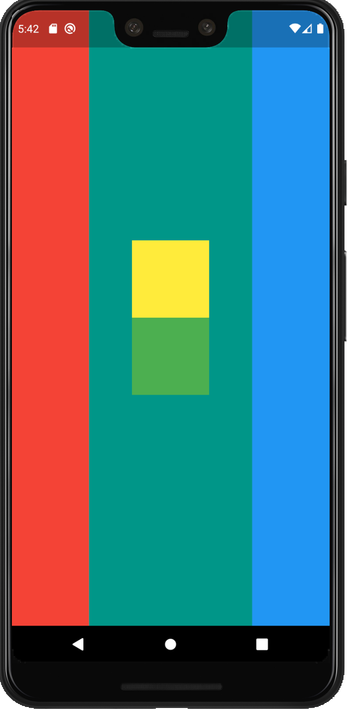
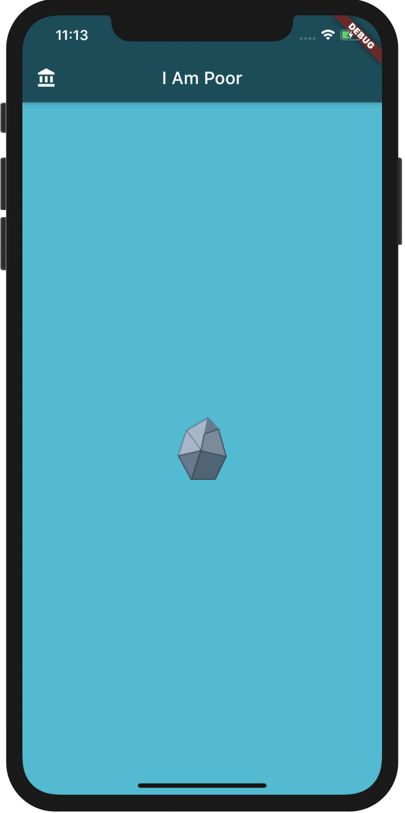
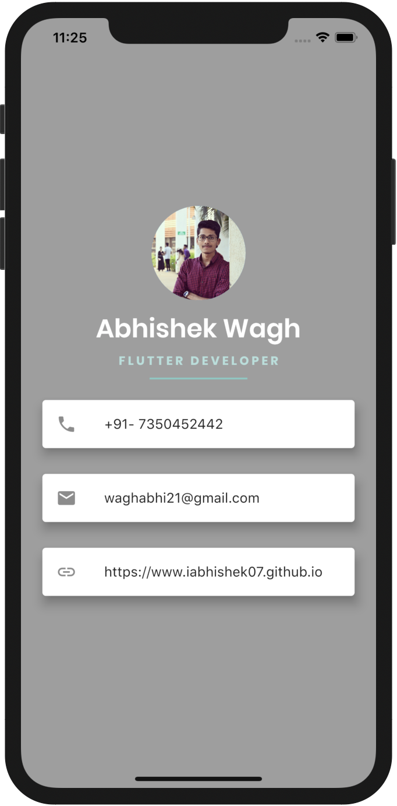
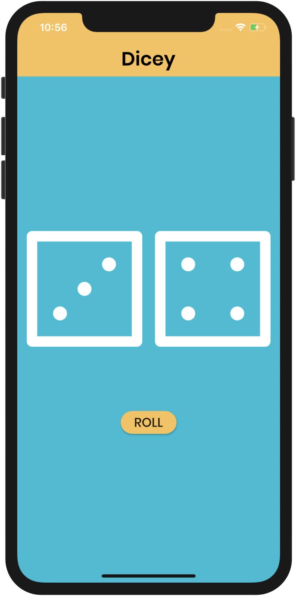
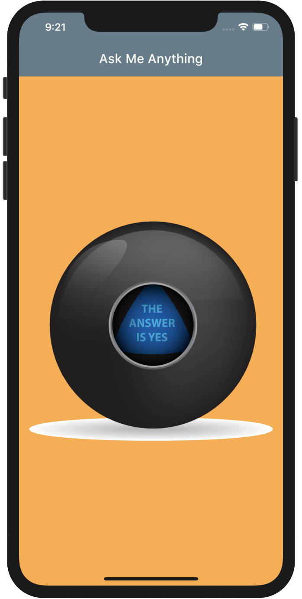
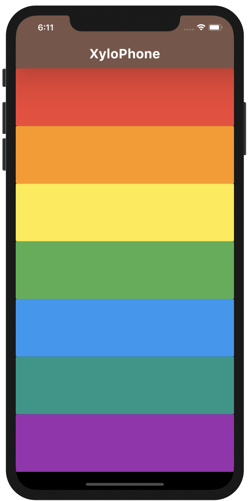
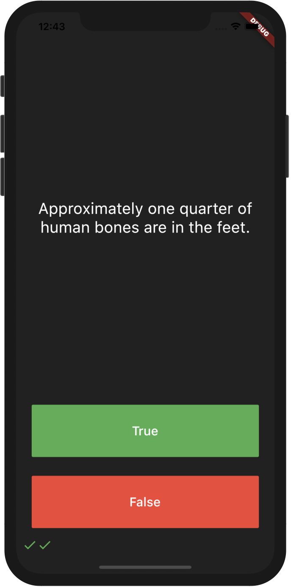

# TheAppBrewery-FlutterCourse
This repository contains all the app development challenges from TheAppBrewery Flutter Course!😁

## 1st Challenge (Layout by Rows & Columns)📱
|                   1.                    |                    2                    |
| :--------------------------------------:| :-------------------------------------: |
|| |

## 2nd Challenge (I Am Poor Stateless App)
|                   1.                    |
| :--------------------------------------:| 
|| 

## 3rd Challenge (Mi-Card App with some basic widgets like Cards, Icons, Padding, CircleAvatar)
|                   1.                    |
| :--------------------------------------:| 
|| 

## 4th Challenge (Dicey StateFull App with some basic functions of Dart(e.g.Random.nextInt())
|                   1.                    |
| :--------------------------------------:| 
|| 

## 5th Challenge (Magic-8-Ball StateFull App with some basic functions of Dart(e.g.Random.nextInt())
|                   1.                    |
| :--------------------------------------:| 
|| 

## 6th Challenge (Xylophone App with Audio library functions)
|                   1.                    |
| :--------------------------------------:| 
|| 

## 7th Challenge (Quizzler an quiz App with OOP)
|                   1.                    |                   2                    |
| :--------------------------------------:| :-------------------------------------: |
|| |
